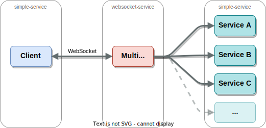

= Multi-Proxy with websocket asynchronous responses

A project with 2 modules.

== link:websocket-service[websocket-service]
Provides a Multi-Proxy service that sends an incoming
request to multiple endpoints simultaneously, then provides
answers back to the client asynchronously on each response
from each endpoint respectively.

== link:simple-service[simple-service]
Provides a simple service (which can be reused
to simulate multiple endpoints that provides this service).

== Overview

== Run
To test this service, you can start the services in the modules (link:simple-service[simple-service] and link:websocket-service[websocket-service]) respectively via
[source,shell]
-----
mvn spring-boot:run
-----
Then navigate to http://localhost:8082 view the example client
webpage (this can be done in multiple web windows to simulate
more than one client simultaneously accessing the proxy)
